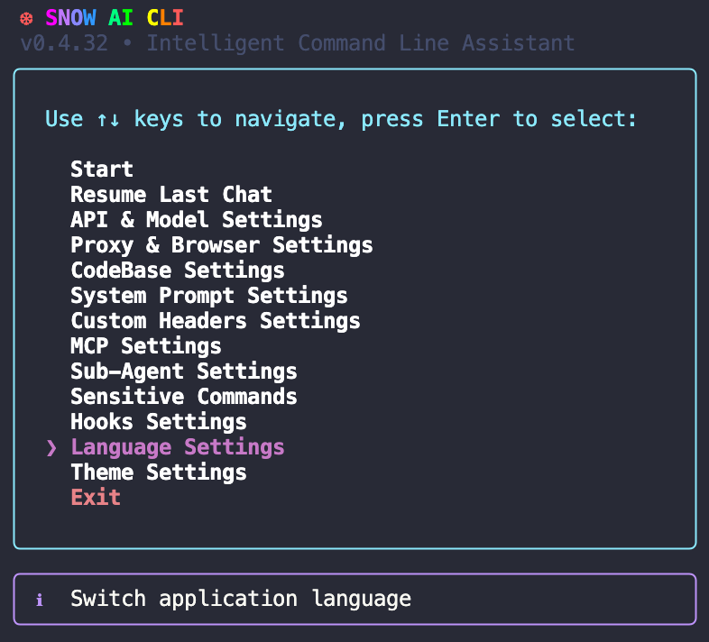
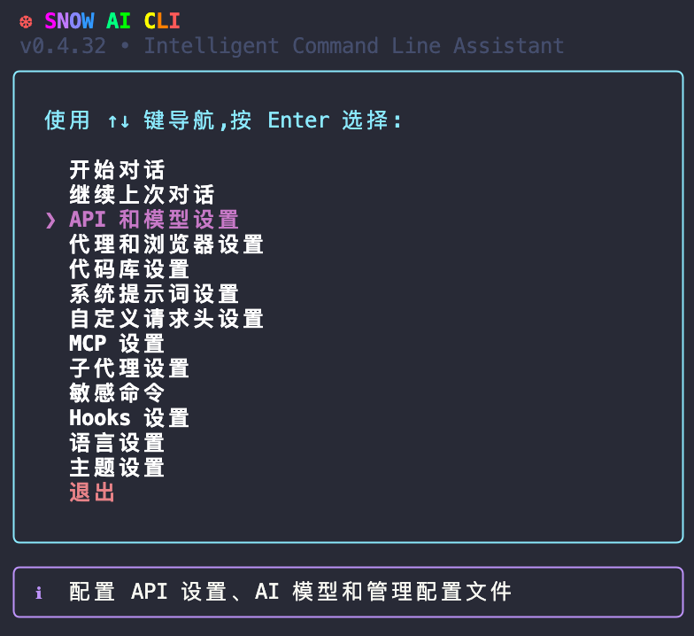
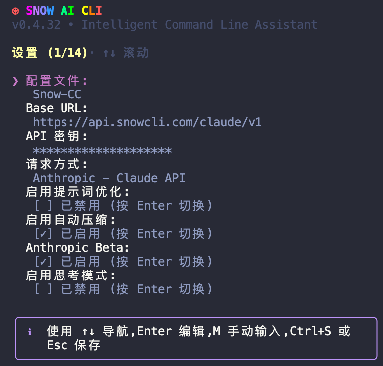

# Snow CLI 使用文档——首次配置

欢迎使用 Snow CLI！在终端中进行 Agentic 编程。

## 首次配置

### 1、在任意目录下进入命令行

1. 键入 `snow` 启动 Snow CLI 或点击 IDE 插件中的启动图标
2. Snow CLI 的首选语言为 `English`，可先前往 `Language Settings` 中修改自己语言偏好

   

### 2、进入配置界面

设置完语言偏好后进入 `API 和模型设置`



配置界面提供了完整的 AI 服务配置功能，支持多配置文件（Profile）管理和丰富的模型参数设置。

## 配置项详细说明

### 配置文件管理（Profile）

**作用**：管理多套配置方案，方便在不同场景下快速切换

**操作方式**：

- 按回车键进入配置文件选择界面
- 使用上下箭头选择配置文件
- 当前激活的配置文件会显示绿色 ✓ 标记

**快捷操作**：

- 按 `n` 键：创建新配置文件（需输入配置文件名称）
- 按 `d` 键：删除当前配置文件（default 配置文件不可删除）

**注意事项**：

- 每个配置文件独立保存所有设置项
- 切换配置文件会立即加载该配置文件的所有设置

### 基础配置

#### Base URL（必填）

**作用**：API 服务的基础地址

**配置方式**：

- 按回车键进入编辑模式
- 输入完整的 API 地址
- 再次按回车键确认

**标准地址**：



1. **OpenAI Chat Completion**

   ```
   https://api.openai.com/v1
   ```

   适用于 OpenAI 的标准聊天补全 API

2. **OpenAI Responses**

   ```
   https://api.openai.com/v1
   ```

   适用于 OpenAI 的响应式 API，支持推理功能

3. **Gemini**

   ```
   https://generativelanguage.googleapis.com/v1beta
   ```

   Google Gemini API 服务地址

4. **Anthropic**
   ```
   https://api.anthropic.com/v1
   ```
   Claude 模型的 API 服务地址

**注意事项**：

- 支持使用代理或第三方中转服务的地址
- 确保地址格式正确，以 `https://` 开头
- 地址末尾通常包含版本号（如 `/v1`）

#### API Key（必填）

**作用**：API 服务的访问密钥

**配置方式**：

- 按回车键进入编辑模式
- 输入完整的 API Key
- 输入时会自动隐藏显示为 `*` 号
- 再次按回车键确认

**注意事项**：

- API Key 通常以特定前缀开头（如 OpenAI 的 `sk-`）
- 保管好 API Key，避免泄露
- 显示时只会显示星号，不会明文显示

#### Request Method（请求方案）

**作用**：选择 API 的调用方式，不同方案支持不同的功能特性

**可选值**：

- **OpenAI Chat Completion**：标准的 OpenAI 聊天 API
- **OpenAI Responses**：支持推理模式的 OpenAI API
- **Gemini**：Google 的 Gemini 模型
- **Anthropic**：Claude 模型

**配置方式**：

- 按回车键打开选择列表
- 使用上下箭头选择
- 按回车键确认

**注意事项**：

- 不同请求方案会显示不同的高级配置项
- 切换请求方案时，特定功能配置项会自动调整

#### 系统提示词（选填）

**作用**：为当前配置文件选择要使用的系统提示词

**可选值**：

- **跟随全局（无）**：使用全局设置，当前未激活任何系统提示词
- **跟随全局（名称）**：使用全局设置中激活的系统提示词
- **不使用**：明确禁用系统提示词，即使全局有激活的提示词
- **选择具体提示词**：从已配置的系统提示词列表中选择

**配置方式**：

- 按回车键打开选择列表
- 使用上下箭头选择
- 按回车键确认

**说明**：

- 系统提示词可以在"系统提示词管理"界面中创建和管理
- Profile 级别的设置会覆盖全局设置
- 选择"不使用"可以在特定场景下临时禁用系统提示词

#### 自定义请求头（选填）

**作用**：为当前配置文件选择要使用的自定义请求头方案

**可选值**：

- **跟随全局（无）**：使用全局设置，当前未激活任何请求头方案
- **跟随全局（名称）**：使用全局设置中激活的请求头方案
- **不使用**：明确禁用自定义请求头，即使全局有激活的方案
- **选择具体方案**：从已配置的请求头方案列表中选择

**配置方式**：

- 按回车键打开选择列表
- 使用上下箭头选择
- 按回车键确认

**说明**：

- 自定义请求头方案可以在"自定义请求头管理"界面中创建和管理
- Profile 级别的设置会覆盖全局设置
- 选择"不使用"可以在特定场景下临时禁用自定义请求头

### 高级配置

#### Enable Auto Compress（自动压缩）

**作用**：自动压缩长文本内容，减少 token 消耗

**默认值**：启用

**配置方式**：

- 按回车键或空格键切换启用/禁用状态
- 显示 "Enabled" 或 "Disabled"

**建议**：启用可降低 API 调用成本，但可能会丢失部分上下文细节

#### Show Thinking（显示思考过程）

**作用**：在界面中显示 AI 的思考推理过程

**默认值**：启用

**配置方式**：

- 按回车键或空格键切换启用/禁用状态
- 显示 "Enabled" 或 "Disabled"

**建议**：启用可了解 AI 的推理过程，有助于调试和理解结果

### Anthropic 专属配置

当选择 `Anthropic` 请求方案时，会显示以下配置项：

#### Anthropic Beta（测试功能）

**作用**：启用 Anthropic 的 Beta 版本功能

**默认值**：禁用

**配置方式**：

- 按回车键或空格键切换启用/禁用状态

**注意事项**：Beta 功能可能不稳定，请谨慎使用

#### Anthropic Cache TTL（缓存时间）

**作用**：设置提示词缓存的有效期

**可选值**：

- `5m`：5 分钟
- `1h`：1 小时

**默认值**：5 分钟

**配置方式**：

- 按回车键打开选择列表
- 选择缓存时间
- 按回车键确认

**说明**：较长的缓存时间可减少重复内容的 token 消耗

#### Thinking Enabled（扩展思考模式）

**作用**：启用 Claude 的扩展思考功能

**默认值**：禁用

**配置方式**：

- 按回车键或空格键切换启用/禁用状态

**说明**：启用后 AI 会进行更深入的推理

#### Thinking Budget Tokens（思考预算 Token）

**作用**：设置扩展思考模式的最大 token 数量

**默认值**：10000

**取值范围**：最小值 1000

**配置方式**：

- 按回车键进入编辑模式
- 输入数字（支持退格删除）
- 按回车键确认

**注意事项**：

- 思考预算越大，AI 推理越深入，但消耗 token 也越多
- 如果输入值小于最小值，保存时会自动调整为最小值

### Gemini 专属配置

当选择 `Gemini` 请求方案时，会显示以下配置项：

#### Gemini Thinking Enabled（Gemini 思考模式）

**作用**：启用 Gemini 的思考推理功能

**默认值**：禁用

**配置方式**：

- 按回车键或空格键切换启用/禁用状态

#### Gemini Thinking Budget（思考预算）

**作用**：设置 Gemini 思考模式的预算值

**默认值**：1024

**取值范围**：最小值 1

**配置方式**：

- 按回车键进入编辑模式
- 输入数字（支持退格删除）
- 按回车键确认

### OpenAI Responses 专属配置

当选择 `OpenAI Responses` 请求方案时，会显示以下配置项：

#### Responses Reasoning Enabled（推理模式）

**作用**：启用 OpenAI 的推理功能

**默认值**：禁用

**配置方式**：

- 按回车键或空格键切换启用/禁用状态

#### Responses Reasoning Effort（推理强度）

**作用**：设置推理模式的强度级别

**可选值**：

- `LOW`：低强度推理
- `MEDIUM`：中等强度推理
- `HIGH`：高强度推理
- `XHIGH`：超高强度推理（仅 responses 方案支持）

**默认值**：HIGH

**配置方式**：

- 按回车键打开选择列表
- 使用上下箭头选择强度
- 按回车键确认

**注意事项**：推理强度越高，推理过程越深入，但耗时和 token 消耗也越大

### 模型配置

#### Advanced Model（高级模型）

**作用**：用于复杂任务的主力模型

**配置方式**：

1. 按回车键自动获取可用模型列表（需要正确配置 Base URL 和 API Key）
2. 如果获取失败，会自动进入手动输入模式
3. 可以使用字母数字输入进行模糊搜索过滤
4. 选择 "Manual Input" 选项可手动输入模型名称
5. 按 `m` 键快速进入手动输入模式

**常见模型示例**：

- OpenAI: `gpt-4`, `gpt-4-turbo`, `gpt-4o`
- Claude: `claude-3-5-sonnet-20241022`, `claude-3-opus-20240229`
- Gemini: `gemini-2.0-flash-exp`, `gemini-pro`

**建议**：选择性能较强的模型用于复杂编程任务

#### Basic Model（基础模型）

**作用**：用于简单任务的辅助模型

**配置方式**：与 Advanced Model 相同

**常见模型示例**：

- OpenAI: `gpt-3.5-turbo`, `gpt-4o-mini`
- Claude: `claude-3-haiku-20240307`
- Gemini: `gemini-flash`

**建议**：选择响应速度快、成本较低的模型

#### Max Context Tokens（最大上下文令牌）

**作用**：模型支持的最大上下文窗口大小

**默认值**：4000

**取值范围**：最小值 4000

**配置方式**：

- 按回车键进入编辑模式
- 输入数字（支持退格删除）
- 按回车键确认

**常见模型上下文容量**：

- Claude 3.5 Sonnet: 200000
- GPT-4 Turbo: 128000
- GPT-4: 8192
- Gemini 2.0 Flash: 1000000
- Gemini Pro: 32768

**注意事项**：

- 必须设置为模型实际支持的上下文大小
- 设置过大会导致 API 调用失败
- 设置过小会限制对话长度

#### Max Tokens（最大回复令牌数）

**作用**：单次响应允许生成的最大 token 数量

**默认值**：4096

**取值范围**：最小值 100

**配置方式**：

- 按回车键进入编辑模式
- 输入数字（支持退格删除）
- 按回车键确认

**常见模型输出容量**：

- Claude 3.5 Sonnet: 64000
- GPT-4 Turbo: 4096
- GPT-4: 8192
- Gemini 2.0 Flash: 8192

**注意事项**：

- 不同模型支持的最大输出 token 数不同
- 设置过大会增加响应时间和成本
- 建议根据实际需求合理设置

#### 文件编辑相似度阈值（高级选项，非必要不修改）

**作用**：控制 AI 在修改文件时的匹配精度，影响代码编辑的准确性

**默认值**：0.75

**取值范围**：0.1 - 1.0（小数）

**配置方式**：

- 按回车键进入编辑模式
- 输入数字，支持小数（如 0.75, 0.8）
- 支持退格删除
- 按回车键确认

**说明**：

- **阈值越高**：匹配越严格，只有非常相似的代码才会被修改，降低误修改风险
- **阈值越低**：匹配越宽松，允许更多的差异（如缩进、空格），提高灵活性
- **默认值 0.75**：在精确性和灵活性之间取得平衡，适用于大多数场景

**建议**：

- 保持默认值即可，除非遇到特殊问题
- 如果 AI 经常找不到要修改的代码，可以适当降低（如 0.6-0.7）
- 如果 AI 误修改了相似但不同的代码，可以适当提高（如 0.8-0.85）
- 不建议设置低于 0.6 或高于 0.9

**注意事项**：

- 此配置影响所有代码编辑操作
- 修改后立即生效，无需重启
- 错误的设置可能导致代码编辑失败或误修改

## 配置界面操作说明

### 基本操作

- **上下箭头**：在配置项之间移动
- **回车键**：进入编辑模式或确认输入
- **Esc 键**：保存配置并退出
- **Ctrl+S / Cmd+S**：快速保存配置
- **空格键**：切换开关类配置项（如 Enable/Disable）

### 导航提示

- 配置界面顶部显示当前位置：`(当前项/总项数)`
- 配置项超过 8 项时，会自动滚动显示
- 当前选中的配置项会显示 `❯` 标记

### 模型选择增强功能

在模型选择界面中：

- **字母数字输入**：实时过滤模型列表
- **Backspace**：删除过滤字符
- **Esc 键**：退出选择界面
- **m 键**：快速进入手动输入模式

### 数字输入增强

在编辑 token 相关配置时：

- **数字键**：追加数字
- **Backspace/Delete**：删除最后一位数字
- **回车键**：确认并自动校验最小值

## 配置验证

保存配置时系统会自动验证：

1. **必填项检查**：Base URL 和 API Key 必须填写
2. **格式验证**：检查 Base URL 格式是否正确
3. **数值范围**：自动调整 token 配置到最小值以上
4. **请求方案匹配**：验证所选模型与请求方案的兼容性

**错误提示**：

- 验证失败时会在界面底部显示红色错误信息
- 修复错误后可再次尝试保存

## 配置文件存储

- **主配置文件**：`~/.snowcli/config.json`
- **配置文件目录**：`~/.snowcli/profiles/`
- **自动保存**：退出配置界面时自动保存到当前激活的配置文件

## 常见问题

### 1. 无法获取模型列表？

**解决方案**：

- 检查 Base URL 和 API Key 是否正确
- 检查网络连接和代理设置
- 如果持续失败，使用手动输入模式（按 `m` 键）

### 2. 配置保存后不生效？

**解决方案**：

- 确认已按 Esc 或 Ctrl+S 保存配置
- 重启 Snow CLI 确保配置加载
- 检查是否选择了正确的配置文件（Profile）

### 3. Token 超限错误？

**解决方案**：

- 检查 Max Context Tokens 是否设置正确
- 确认是否超过模型实际支持的上下文大小
- 适当减少 Max Tokens 设置

### 4. 切换请求方案后配置丢失？

**说明**：不同请求方案的专属配置项（如 Anthropic 的 Thinking 功能）会根据当前方案自动显示/隐藏，配置值仍然保存，切换回来会恢复。

## 配置最佳实践

1. **首次配置**：先设置 Basic 配置（Base URL、API Key、Request Method），再配置高级功能
2. **多场景使用**：为不同项目创建不同的配置文件（Profile）
3. **成本优化**：合理设置 Max Tokens，启用 Auto Compress 功能
4. **性能优化**：根据任务复杂度选择合适的模型，简单任务使用 Basic Model
5. **调试建议**：启用 Show Thinking 查看 AI 推理过程，便于理解和优化提示词
